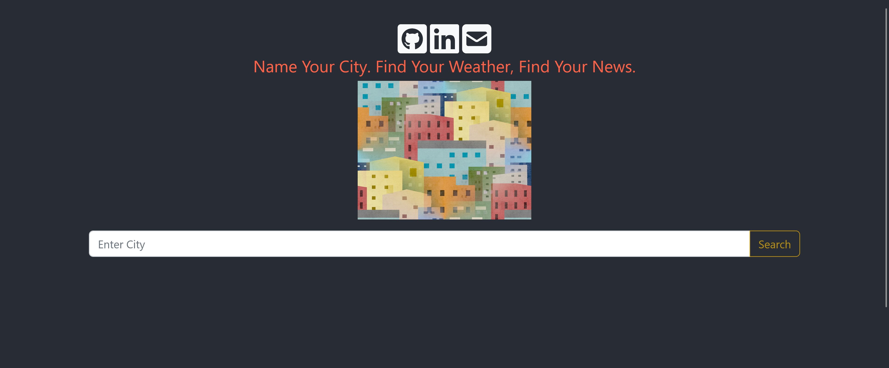
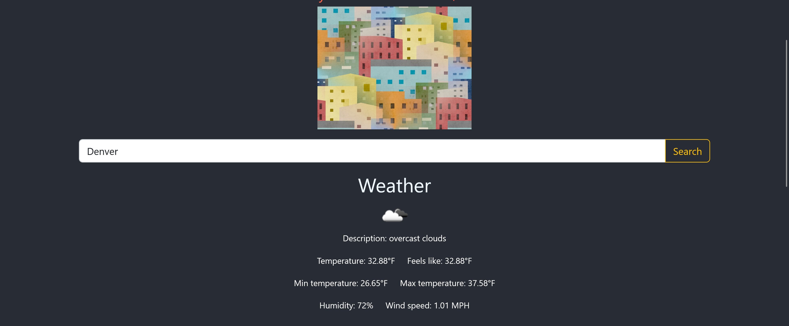
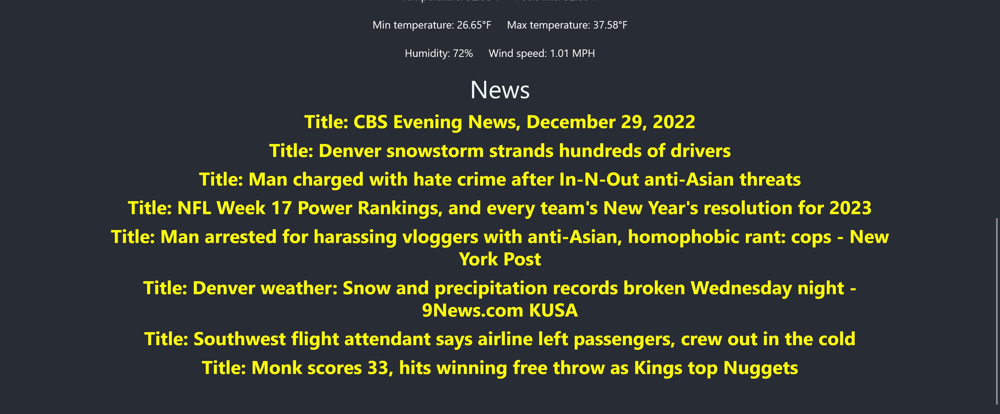

## Mycity
(COMPLETED)

## [The App's Website](mycity-env.eba-rypwjnfp.us-east-1.elasticbeanstalk.com)
JAVA VERSION
* Java 17

Dependencies (SpringBoot):
* Spring Web
* Lombok
* httpclient (org.apache.httpcomponents)

Spring Boot backend contacts the Weather API and the 
NewsData.io API and displays it to the React frontend. 
The user can see at most ten articles.

This is the homepage.

After entering Denver, the weather and news data are displayed.

The user can now click on one of the links.

